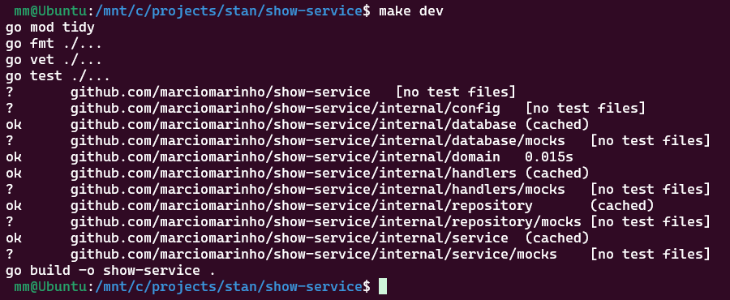

# Show Service

A REST API service for managing TV shows, built with Go, Gin, and DynamoDB. This service provides endpoints for creating and retrieving show information with comprehensive validation and testing.

## Project Structure

```
show-service/
├── configs/                    # Configuration files
│   └── config.dev.yaml         # Application configuration (AWS Dev env)
│   └── config.local.yaml       # Application configuration (Local env)
├── curl_for_manual_tests/      # API testing examples and scripts
├── internal/                  # Private application code
│   ├── config/               # Configuration management
│   │   ├── config.go         # Config loading and validation
│   │   └── config_test.go    # Configuration tests
│   ├── database/             # Database layer
│   │   ├── dynamo.go         # DynamoDB wrapper
│   │   ├── dynamo_test.go    # Database tests
│   │   └── mocks/            # Database mocks
│   │       └── mock_dynamoapi.go
│   ├── domain/               # Business logic models
│   │   ├── model.go          # Data structures and validation
│   │   └── model_test.go     # Domain tests
│   ├── handlers/             # HTTP handlers
│   │   ├── health.go         # Health check endpoint
│   │   ├── shows.go          # Show CRUD endpoints
│   │   ├── shows_test.go     # Handler tests
│   │   └── mocks/            # Handler mocks
│   │       └── mock_showhandler.go
│   ├── repository/           # Data access layer
│   │   ├── show_repo.go      # Show repository implementation
│   │   ├── show_repo_test.go # Repository tests
│   │   └── mocks/            # Repository mocks
│   │       └── mock_showrepository.go
│   └── service/              # Business logic layer
│       ├── show_service.go   # Show service implementation
│       ├── show_service_test.go # Service tests
│       └── mocks/            # Service mocks
│           └── mock_showservice.go
├── test/                       # Integration tests and test data
│   ├── integration_tests/      # Integration tests
│   │   ├── integration_test.go # End-to-end integration tests
│   │   └── data/               # Test data files
│   │       ├── complete_request.json  # Test request payload
│   │       └── expected_complete_response.json # Expected response data
├── .mockery.yml             # Mockery configuration
├── Dockerfile               # Application container
├── docker-compose.yml       # Local development environment
├── Makefile                 # Development commands
├── swagger.yaml             # API specification
└── main.go                  # Application entry point
```

## Makefile Targets

The project includes a Makefile with convenient targets for development and deployment:

### Development Targets

- **`make help`** - Show all available targets and their descriptions
- **`make tidy`** - Clean up `go.mod` and `go.sum` files
- **`make fmt`** - Format Go code across the project
- **`make vet`** - Check for suspicious code constructs
- **`make test`** - Run unit tests (excludes integration tests)
- **`make build`** - Build the application binary
- **`make clean`** - Remove build artifacts

### Testing Targets

- **`make integration-test`** - Run end-to-end integration tests (requires Docker)

### Docker Targets

- **`make start-dynamo`** - Start DynamoDB Local only
- **`make start`** - Start both DynamoDB Local and the application
- **`make stop`** - Stop all Docker services
- **`make restart`** - Restart all Docker services
- **`make logs`** - Show logs from all services
- **`make logs-dynamo`** - Show logs from DynamoDB Local only
- **`make logs-app`** - Show logs from the application only

### Workflow Targets

- **`make dev`** - Run full development checks (tidy, format, vet, test, build)
- **`make quick-start`** - Build and start everything
- **`make reset`** - Reset everything (stop, clean, rebuild, start fresh)
- **`make build-prod`** - Build for production (Linux binary)

## Design Decisions

### Architecture Pattern
The application follows a **Clean Architecture** pattern with clear separation of concerns:

- **Handlers**: HTTP request/response handling
- **Service**: Business logic orchestration
- **Repository**: Data access abstraction
- **Domain**: Core business models and validation
- **Database**: External data store integration

### Data Model

#### Show Entity Structure
```go
type Show struct {
    Slug          string       `json:"slug"`                       // Primary Key
    Title         string       `json:"title"`                      // Required
    Country       *string      `json:"country,omitempty"`          // Optional
    Description   *string      `json:"description,omitempty"`      // Optional
    DRM           *bool        `json:"drm,omitempty"`              // Optional
    EpisodeCount  *int         `json:"episodeCount,omitempty"`     // Optional
    Genre         *string      `json:"genre,omitempty"`            // Optional
    Image         *Image       `json:"image,omitempty"`            // Optional
    Language      *string      `json:"language,omitempty"`         // Optional
    NextEpisode   *NextEpisode `json:"nextEpisode,omitempty"`      // Optional
    PrimaryColour *string      `json:"primaryColour,omitempty"`    // Optional
    Seasons       *[]Season    `json:"seasons,omitempty"`          // Optional
    TVChannel     *string      `json:"tvChannel,omitempty"`        // Optional
}
```

#### Primary Key Strategy
- **Slug as Primary Key**: The `slug` field serves as the primary key in DynamoDB
- **Format**: `show/{handle}` where handle contains letters, digits, and dashes
- **Uniqueness**: Attempting to insert a show with an existing slug results in an error
- **Validation**: Enforced via regex pattern matching

#### Alternative Data Stores Considered
While DynamoDB was chosen for this implementation, I could have used other databases, or the code can also be modified and extended to support multiple database types.

- **PostgreSQL/MySQL**: Traditional relational databases
- **Amazon S3**: JSON storage for simple use cases
- **Redis**: For caching or session storage

### Technology Stack

#### Core Technologies
- **Go 1.25**: Modern Go version with enhanced features
- **Gin Framework**: HTTP web framework for REST APIs
- **DynamoDB**: NoSQL database for scalable data storage
- **AWS SDK v2**: Official AWS SDK for Go

#### Development Tools
- **Mockery**: Mock generation for unit testing
- **Testify**: Testing assertions and utilities
- **Docker**: Containerization for development and deployment

#### Validation & Quality
- **ozzo-validation**: Declarative validation framework
- **go vet**: Static analysis for suspicious code
- **go fmt**: Code formatting enforcement

## Quick Start

### Prerequisites
- Go 1.25+
- Docker and Docker Compose
- Make (optional, for using Makefile commands)

### Local Development Setup

1. **Clone the repository**
   ```bash
   git clone <repository-url>
   cd show-service
   ```

2. **Install dependencies**
   ```bash
   go mod tidy
   ```

3. **Start DynamoDB Local**
   ```bash
   make start-dynamo
   # or
   docker-compose up dynamodb-local -d
   ```

4. **Run the application**
   ```bash
   make start
   # or
   docker-compose up --build
   ```

5. **Verify it's running**
   - API: http://localhost:8080
   - Health check: http://localhost:8080/health
   - DynamoDB: http://localhost:8000

## Sample Screenshots

### make dev



### make start-dynamo


### make start

Starts the application and DynamoDB Local

```bash
 mm@Ubuntu:/mnt/c/projects/stan/show-service$ make start
docker-compose up --build
[+] Building 25.2s (33/33) FINISHED
 => [internal] load local bake definitions                                                                                                                                             0.0s
 => => reading from stdin 1.05kB                                                                                                                                                       0.0s
 => [dynamodb-local internal] load build definition from Dockerfile.dynamodb                                                                                                           0.0s
 => => transferring dockerfile: 715B                                                                                                                                                   0.0s
 => [show-service internal] load build definition from Dockerfile                                                                                                                      0.0s
 => => transferring dockerfile: 612B                                                                                                                                                   0.0s
 => [dynamodb-local internal] load metadata for docker.io/amazon/dynamodb-local:latest                                                                                                 1.4s
 => [show-service internal] load metadata for docker.io/library/alpine:latest                                                                                                          1.5s
 => [show-service internal] load metadata for docker.io/library/golang:1.25.3-alpine                                                                                                   1.4s
 => [auth] amazon/dynamodb-local:pull token for registry-1.docker.io                                                                                                                   0.0s
 => [auth] library/alpine:pull token for registry-1.docker.io                                                                                                                          0.0s
 => [auth] library/golang:pull token for registry-1.docker.io                                                                                                                          0.0s
 => [dynamodb-local internal] load .dockerignore                                                                                                                                       0.0s
 => => transferring context: 2B                                                                                                                                                        0.0s
 => [dynamodb-local 1/5] FROM docker.io/amazon/dynamodb-local:latest@sha256:7ef4a2c45b58c2901e70a4f28e0953a422c2c631baaaf5e2c15e0805740c7752                                           0.0s
 => => resolve docker.io/amazon/dynamodb-local:latest@sha256:7ef4a2c45b58c2901e70a4f28e0953a422c2c631baaaf5e2c15e0805740c7752                                                          0.0s
 => [dynamodb-local internal] load build context                                                                                                                                       0.0s
 => => transferring context: 35B                                                                                                                                                       0.0s
 => CACHED [dynamodb-local 2/5] RUN yum update -y &&     yum install -y python3 python3-pip &&     pip3 install awscli &&     yum clean all                                            0.0s
 => CACHED [dynamodb-local 3/5] RUN mkdir -p /root/.aws &&     echo "[default]\naws_access_key_id = dummy\naws_secret_access_key = dummy\nregion = ap-southeast-2" > /root/.aws/crede  0.0s
 => CACHED [dynamodb-local 4/5] COPY entrypoint.sh /entrypoint.sh                                                                                                                      0.0s
 => CACHED [dynamodb-local 5/5] RUN chmod +x /entrypoint.sh                                                                                                                            0.0s
 => [dynamodb-local] exporting to image                                                                                                                                                0.0s
 => => exporting layers                                                                                                                                                                0.0s
 => => writing image sha256:0dff854a67e4bf7a97eb0d26a398145c86aea1008280352fa49ccf94009fcf56                                                                                           0.0s
 => => naming to docker.io/library/show-service-dynamodb-local                                                                                                                         0.0s
 => [show-service internal] load .dockerignore                                                                                                                                         0.0s
 => => transferring context: 2B                                                                                                                                                        0.0s
 => [dynamodb-local] resolving provenance for metadata file                                                                                                                            0.0s
 => [show-service builder 1/6] FROM docker.io/library/golang:1.25.3-alpine@sha256:aee43c3ccbf24fdffb7295693b6e33b21e01baec1b2a55acc351fde345e9ec34                                     0.0s
 => [show-service stage-1 1/5] FROM docker.io/library/alpine:latest@sha256:4b7ce07002c69e8f3d704a9c5d6fd3053be500b7f1c69fc0d80990c2ad8dd412                                            0.0s
 => [show-service internal] load build context                                                                                                                                         2.2s
 => => transferring context: 62.88kB                                                                                                                                                   2.2s
 => CACHED [show-service builder 2/6] WORKDIR /app                                                                                                                                     0.0s
 => CACHED [show-service builder 3/6] COPY go.mod go.sum ./                                                                                                                            0.0s
 => CACHED [show-service builder 4/6] RUN go mod download                                                                                                                              0.0s
 => [show-service builder 5/6] COPY . .                                                                                                                                                0.3s
 => [show-service builder 6/6] RUN CGO_ENABLED=0 GOOS=linux go build -o show-service .                                                                                                20.1s
 => CACHED [show-service stage-1 2/5] RUN apk --no-cache add ca-certificates                                                                                                           0.0s
 => CACHED [show-service stage-1 3/5] WORKDIR /root/                                                                                                                                   0.0s
 => CACHED [show-service stage-1 4/5] COPY --from=builder /app/show-service .                                                                                                          0.0s
 => CACHED [show-service stage-1 5/5] COPY --from=builder /app/configs ./configs                                                                                                       0.0s
 => [show-service] exporting to image                                                                                                                                                  0.0s
 => => exporting layers                                                                                                                                                                0.0s
 => => writing image sha256:c0885266abe58efe9b0353598aa54cd3e4f5f4142fb758219c753a88815b9bab                                                                                           0.0s
 => => naming to docker.io/library/show-service-show-service                                                                                                                           0.0s
 => [show-service] resolving provenance for metadata file                                                                                                                              0.0s
[+] Running 5/5
 ✔ show-service-dynamodb-local   Built                                                                                                                                                 0.0s
 ✔ show-service-show-service     Built                                                                                                                                                 0.0s
 ✔ Network show-service_default  Created                                                                                                                                               0.1s
 ✔ Container dynamodb-local      Created                                                                                                                                               0.1s
 ✔ Container show-service        Created                                                                                                                                               0.1s
Attaching to dynamodb-local, show-service
dynamodb-local  | Waiting for DynamoDB Local to start...
show-service    | [GIN-debug] [WARNING] Creating an Engine instance with the Logger and Recovery middleware already attached.
show-service    |
show-service    | [GIN-debug] [WARNING] Running in "debug" mode. Switch to "release" mode in production.
show-service    |  - using env: export GIN_MODE=release
show-service    |  - using code:        gin.SetMode(gin.ReleaseMode)
show-service    |
show-service    | [GIN-debug] GET    /health                   --> github.com/marciomarinho/show-service/internal/handlers.HealthCheck (4 handlers)
show-service    | [GIN-debug] POST   /shows                    --> github.com/marciomarinho/show-service/internal/handlers.ShowHandler.PostShows-fm (4 handlers)
show-service    | [GIN-debug] GET    /shows                    --> github.com/marciomarinho/show-service/internal/handlers.ShowHandler.GetShows-fm (4 handlers)
show-service    | 2025/10/18 02:59:16 env=local table=shows-local listening=:8080
show-service    | [GIN-debug] [WARNING] You trusted all proxies, this is NOT safe. We recommend you to set a value.
show-service    | Please check https://github.com/gin-gonic/gin/blob/master/docs/doc.md#dont-trust-all-proxies for details.
show-service    | [GIN-debug] Listening and serving HTTP on :8080
dynamodb-local  | Initializing DynamoDB Local with the following configuration:
dynamodb-local  | Port: 8000
dynamodb-local  | InMemory:     true
dynamodb-local  | Version:      3.1.0
dynamodb-local  | DbPath:       null
dynamodb-local  | SharedDb:     false
dynamodb-local  | shouldDelayTransientStatuses: false
dynamodb-local  | CorsParams:   null
dynamodb-local  |
dynamodb-local  | Creating DynamoDB table with GSI...
dynamodb-local  | {
dynamodb-local  |     "TableDescription": {
dynamodb-local  |         "AttributeDefinitions": [
dynamodb-local  |             {
dynamodb-local  |                 "AttributeName": "slug",
dynamodb-local  |                 "AttributeType": "S"
dynamodb-local  |             },
dynamodb-local  |             {
dynamodb-local  |                 "AttributeName": "drmKey",
dynamodb-local  |                 "AttributeType": "N"
dynamodb-local  |             },
dynamodb-local  |             {
dynamodb-local  |                 "AttributeName": "episodeCount",
dynamodb-local  |                 "AttributeType": "N"
dynamodb-local  |             }
dynamodb-local  |         ],
dynamodb-local  |         "TableName": "shows-local",
dynamodb-local  |         "KeySchema": [
dynamodb-local  |             {
dynamodb-local  |                 "AttributeName": "slug",
dynamodb-local  |                 "KeyType": "HASH"
dynamodb-local  |             }
dynamodb-local  |         ],
dynamodb-local  |         "TableStatus": "ACTIVE",
dynamodb-local  |         "CreationDateTime": 1760756361.763,
dynamodb-local  |         "ProvisionedThroughput": {
dynamodb-local  |             "LastIncreaseDateTime": 0.0,
dynamodb-local  |             "LastDecreaseDateTime": 0.0,
dynamodb-local  |             "NumberOfDecreasesToday": 0,
dynamodb-local  |             "ReadCapacityUnits": 0,
dynamodb-local  |             "WriteCapacityUnits": 0
dynamodb-local  |         },
dynamodb-local  |         "TableSizeBytes": 0,
dynamodb-local  |         "ItemCount": 0,
dynamodb-local  |         "TableArn": "arn:aws:dynamodb:ddblocal:000000000000:table/shows-local",
dynamodb-local  |         "BillingModeSummary": {
dynamodb-local  |             "BillingMode": "PAY_PER_REQUEST",
dynamodb-local  |             "LastUpdateToPayPerRequestDateTime": 1760756361.763
dynamodb-local  |         },
dynamodb-local  |         "GlobalSecondaryIndexes": [
dynamodb-local  |             {
dynamodb-local  |                 "IndexName": "gsi_drm_episode",
dynamodb-local  |                 "KeySchema": [
dynamodb-local  |                     {
dynamodb-local  |                         "AttributeName": "drmKey",
dynamodb-local  |                         "KeyType": "HASH"
dynamodb-local  |                     },
dynamodb-local  |                     {
dynamodb-local  |                         "AttributeName": "episodeCount",
dynamodb-local  |                         "KeyType": "RANGE"
dynamodb-local  |                     }
dynamodb-local  |                 ],
dynamodb-local  |                 "Projection": {
dynamodb-local  |                     "ProjectionType": "ALL"
dynamodb-local  |                 },
dynamodb-local  |                 "IndexStatus": "ACTIVE",
dynamodb-local  |                 "IndexSizeBytes": 0,
dynamodb-local  |                 "ItemCount": 0,
dynamodb-local  |                 "IndexArn": "arn:aws:dynamodb:ddblocal:000000000000:table/shows-local/index/gsi_drm_episode"
dynamodb-local  |             }
dynamodb-local  |         ],
dynamodb-local  |         "DeletionProtectionEnabled": false
dynamodb-local  |     }
dynamodb-local  | }
dynamodb-local  | Table 'shows-local' created successfully with GSI!
```

```bash
docker ps
 mm@Ubuntu:/mnt/c/projects/stan/show-service$ docker ps
CONTAINER ID   IMAGE                         COMMAND            CREATED         STATUS         PORTS                                         NAMES
1100f48f4c00   show-service-show-service     "./show-service"   2 minutes ago   Up 2 minutes   0.0.0.0:8080->8080/tcp, [::]:8080->8080/tcp   show-service
ea02b5b850a3   show-service-dynamodb-local   "/entrypoint.sh"   2 minutes ago   Up 2 minutes   0.0.0.0:8000->8000/tcp, [::]:8000->8000/tcp   dynamodb-local
```

### DynamoDB running on Docker locally


### Manually querying DynamoDB locally

  *** You will need the AWS CLI installed and configured to run this command ***
  ```bash
    export AWS_ACCESS_KEY_ID=dummy
    export AWS_SECRET_ACCESS_KEY=dummy
    export AWS_DEFAULT_REGION=ap-southeast-2

    aws dynamodb scan       --table-name shows-local       --endpoint-url http://localhost:8000
    aws dynamodb list-tables --endpoint-url http://localhost:8000
  ```


### go run main.go


## API Endpoints

### Health Check
```http
GET /v1/health
```

### Shows Management
```http
GET    /v1/shows     # List all shows
POST   /v1/shows     # Create new shows (batch)
```

### Example Requests

#### Create Shows
```bash
cd curl_for_manual_tests

curl -X POST http://localhost:8080/v1/shows \
      -H "Content-Type: application/json" \
      -d @shows_request.json

{"message":"Shows created successfully"}       
```


#### List Shows
```bash
curl http://localhost:8080/v1/shows

{
  "response": [
    {
      "image": "http://catchup.ninemsn.com.au/img/jump-in/shows/Worlds1280.jpg",
      "slug": "show/worlds",
      "title": "World's..."
    },
    {
      "image": "http://catchup.ninemsn.com.au/img/jump-in/shows/TheOriginals1280.jpg",
      "slug": "show/theoriginals",
      "title": "The Originals"
    },
    {
      "image": "http://catchup.ninemsn.com.au/img/jump-in/shows/ToyHunter1280.jpg",
      "slug": "show/toyhunter",
      "title": "Toy Hunter"
    },
    {
      "image": "http://catchup.ninemsn.com.au/img/jump-in/shows/TheTaste1280.jpg",
      "slug": "show/thetaste",
      "title": "The Taste (Le Goût)"
    },
    {
      "image": "http://catchup.ninemsn.com.au/img/jump-in/shows/16KidsandCounting1280.jpg",
      "slug": "show/16kidsandcounting",
      "title": "16 Kids and Counting"
    },
    {
      "image": "http://catchup.ninemsn.com.au/img/jump-in/shows/ScoobyDoo1280.jpg",
      "slug": "show/scoobydoomysteryincorporated",
      "title": "Scooby-Doo! Mystery Incorporated"
    },
    {
      "image": "http://catchup.ninemsn.com.au/img/jump-in/shows/Thunderbirds_1280.jpg",
      "slug": "show/thunderbirds",
      "title": "Thunderbirds"
    }
  ]
}
```


## Development Workflow

### Using Make (Recommended)

```bash
# Development checks (format, vet, test, build)
make dev

# Individual commands
make tidy    # Clean dependencies
make fmt     # Format code
make vet     # Static analysis
make test    # Run tests
make build   # Build application

# Docker commands
make start-dynamo    # Start DynamoDB Local
make start          # Start full stack
make stop           # Stop all services
make logs           # View logs
make logs-app       # View app logs only

# Quick start
make quick-start    # Build and start everything
make reset         # Clean rebuild
```

### Manual Commands

```bash
# Dependencies
go mod tidy

# Code quality
go fmt ./...
go vet ./...

# Testing
go test ./...

# Building
go build -o show-service .

# Running
./show-service

# Docker
docker-compose up --build
```

## Testing

### Running Tests
```bash
# Run all tests
make test
# or
go test ./...

# Run specific package tests
go test ./internal/handlers/...
go test ./internal/service/...
go test ./internal/repository/...
```

### Test Structure
- **Unit Tests**: Each package includes comprehensive tests
- **Mock Testing**: Uses Mockery for dependency isolation
- **Table-Driven Tests**: Consistent test patterns across packages
- **Coverage**: Positive, negative, and edge case scenarios

## Mock Generation

### Setting up Mockery

Mockery is used for generating mocks in unit tests. The Docker image provides a consistent environment across platforms.

#### Docker Setup

```bash
# Test installation
docker run vektra/mockery --version
```

#### Generating Mocks

**Linux/macOS:**
```bash
# Generate all mocks
docker run -v "$PWD":/src -w /src vektra/mockery --all

# Generate specific mocks
docker run -v "$PWD":/src -w /src vektra/mockery --name ShowService
```

**Windows:**
```bash
# Generate all mocks
docker run -v "%cd%":/src -w /src vektra/mockery --all

# Generate specific mocks
docker run -v "%cd%":/src -w /src vektra/mockery --name ShowService
```

**PowerShell:**
```powershell
# Generate all mocks
docker run -v "${PWD}":/src -w /src vektra/mockery --all
```

### Mockery Configuration

The `.mockery.yml` file controls mock generation:

```yaml
with-expecter: true
packages:
  github.com/marciomarinho/show-service/internal/database:
    interfaces:
      DynamoAPI:
  github.com/marciomarinho/show-service/internal/repository:
    interfaces:
      ShowRepository:
  github.com/marciomarinho/show-service/internal/service:
    interfaces:
      ShowService:
  github.com/marciomarinho/show-service/internal/handlers:
    interfaces:
      ShowHandler:
```

## Configuration

### Environment Variables

| Variable | Description | Default |
|----------|-------------|---------|
| `ENV` | Environment (local/dev/prod) | local |
| `DYNAMODB_REGION` | AWS region | ap-southeast-2 |
| `DYNAMODB_ENDPOINT` | DynamoDB endpoint | http://localhost:8000 |
| `SHOWS_TABLE` | DynamoDB table name | shows-local |
| `APP_COGNITO_USER_POOL_ID` | Cognito User Pool ID | - |
| `APP_COGNITO_CLIENT_ID` | Cognito Client ID | - |
| `APP_COGNITO_REGION` | Cognito region | - |
| `APP_COGNITO_JWKS_URL` | Cognito JWKS URL | Auto-constructed |

### Configuration File

Application configuration is managed through `configs/config.yaml`:

```yaml
env: local
log:
  level: info
dynamodb:
  region: ap-southeast-2
  endpoint_override: http://localhost:8000
  shows_table: shows-local
cognito:
  user_pool_id: your-user-pool-id
  client_id: your-client-id
  region: ap-southeast-2
  jwks_url: ""  # Auto-constructed if empty
  valid_scopes:
    - "https://show-service-prod.api/shows.read"
    - "https://show-service-prod.api/shows.write"
    - "https://show-service-prod.api/admin.read"
```
## 🧪 Testing

### Unit Tests
Run all unit tests across the project:

```bash
make test

mm@Ubuntu:/mnt/c/projects/stan/show-service$ make test
go test -cover -count=1 ./internal/...
ok      github.com/marciomarinho/show-service/internal/config   0.009s  coverage: 96.7% of statements
ok      github.com/marciomarinho/show-service/internal/database 0.033s  coverage: 75.0% of statements
        github.com/marciomarinho/show-service/internal/database/mocks           coverage: 0.0% of statements
ok      github.com/marciomarinho/show-service/internal/domain   0.013s  coverage: 94.7% of statements
ok      github.com/marciomarinho/show-service/internal/handlers 0.029s  coverage: 93.1% of statements
        github.com/marciomarinho/show-service/internal/handlers/mocks           coverage: 0.0% of statements
ok      github.com/marciomarinho/show-service/internal/repository       0.009s  coverage: 91.3% of statements
        github.com/marciomarinho/show-service/internal/repository/mocks         coverage: 0.0% of statements
ok      github.com/marciomarinho/show-service/internal/service  0.008s  coverage: 100.0% of statements
        github.com/marciomarinho/show-service/internal/service/mocks            coverage: 0.0% of statements
```

This executes `go test ./...` to run tests in all packages, including handlers, services, repositories, and domain models.

### Integration Tests
Run end-to-end integration tests, which start DynamoDB locally, launch the application, and perform HTTP requests:

```bash
make integration-test
```

**Prerequisites:**
- Docker must be running
- Ensure no conflicting services on ports 8080 (app) and 8000 (DynamoDB)

**What it tests:**
- Starts the full application stack (DynamoDB and app) using docker-compose
- Launches the Go application
- Sends HTTP requests to `/health` and `/shows` endpoints
- Verifies responses and data persistence

**Note:** Integration tests are located in `tests/integration_tests/` and run separately from unit tests.

## Authentication

### JWT Token Validation

The application includes JWT token validation middleware for non-local environments (dev/prod). Authentication is handled via AWS Cognito JWT tokens.

### Authentication Flow

1. **Token Extraction**: Bearer token extracted from `Authorization` header
2. **Environment Check**: Authentication skipped for `local` environment
3. **Token Validation**: JWT signature and claims validation
4. **Scope Validation**: Verify token has required scope for the endpoint **and** that the required scope is in the configured valid scopes list
5. **User Context**: Authenticated user info added to request context

### Protected Endpoints

All endpoints except `/health` require valid JWT authentication:

```http
GET    /shows     # Requires authentication
POST   /shows     # Requires authentication
GET    /health    # Public endpoint
```

### Scope Requirements

Different endpoints require different scopes from the configured `valid_scopes` list:

| Endpoint | Method | Required Scope Pattern |
|----------|--------|------------------------|
| `/shows` | GET | `*.shows.read` |
| `/shows` | POST | `*.shows.write` |

**Note**: The required scope is dynamically determined by finding the first configured scope that contains the pattern (e.g., `shows.read` or `shows.write`).

### Example Authentication

* You will need cognito_id and cognito_secret ( provided via email )

```bash
# Get token from Cognito (example)
BEARER_TOKEN=$(
  curl --location --request POST "https://vl36a5hg13.execute-api.ap-southeast-2.amazonaws.com/oauth/token" \
    --header "Authorization: Basic <id:secret encoded in base64>" \
    --header 'Content-Type: application/x-www-form-urlencoded' \
    --data-urlencode 'grant_type=client_credentials' \
    --data-urlencode 'scope=https://show-service-dev.api/shows.read https://show-service-dev.api/shows.write' \
    | jq -r '.access_token'
)

# Use token in the header for GET requests
curl -X GET https://vl36a5hg13.execute-api.ap-southeast-2.amazonaws.com/v1/shows \
  -H "Authorization: Bearer $BEARER_TOKEN"

# Use token in the header for POST requests
# Make sure you have the shows_request.json file (payload) in the same directory
# Alternatively, you can also use :
## Posman - https://www.postman.com/
## Insomnia - https://github.com/Kong/insomnia
## etc.
curl --location --request POST https://vl36a5hg13.execute-api.ap-southeast-2.amazonaws.com/v1/shows \
  --header "Authorization: Bearer $BEARER_TOKEN" \
  --header 'Content-Type: application/json' \
  --data @shows_request.json

```

### Configuration

Configure Cognito settings in `configs/config.yaml`:

```yaml
cognito:
  user_pool_id: ap-southeast-2_XXXXXXXXX
  client_id: 1a2b3c4d5e6f7g8h9i0j
  region: ap-southeast-2
  jwks_url: ""  # Auto-constructed if empty
  valid_scopes:
    - "https://show-service-prod.api/shows.read"
    - "https://show-service-prod.api/shows.write"
    - "https://show-service-prod.api/admin.read"
```

### Development Notes

- **Local Environment**: Authentication is bypassed for development
- **Token Validation**: Currently implements basic format validation
- **Scope Validation**: Validates against configured `valid_scopes` list
- **Configuration**: Required scopes must be present in config file's `valid_scopes` array
- **Production**: Implement full JWT validation with Cognito JWKS
- **Error Responses**: Returns `401 Unauthorized` for invalid/missing tokens, `403 Forbidden` for insufficient scope

### Future Enhancements

For production deployment, implement complete JWT validation:

1. **JWKS Fetching**: Dynamic retrieval of Cognito public keys
2. **Token Caching**: Cache public keys to reduce latency
3. **Claim Validation**: Verify issuer, audience, expiration
4. **Group Authorization**: Role-based access control
5. **Token Refresh**: Handle token expiration gracefully

### Docker Deployment

```bash
# Build production image
make build-prod

# Or manually
CGO_ENABLED=0 GOOS=linux go build -a -installsuffix cgo -o show-service .

# Run with Docker Compose
docker-compose up -d
```

### AWS Deployment

The application is designed for AWS deployment with:
- **DynamoDB**: Data storage
- **API Gateway**: HTTP API management
- **Lambda**: Serverless compute (if needed)
- **CloudWatch**: Logging and monitoring

## Extras

1. **Code Style**: Follow Go conventions and run `make fmt`
2. **Testing**: Write tests for new features, run `make test`
3. **Mocks**: Update mocks when interfaces change
4. **Documentation**: Update README for significant changes

**Note**: 

- This service assumes `slug` as the primary key for shows. If you need different partitioning strategies or data models, consider the repository pattern which allows for easy data store replacement.

